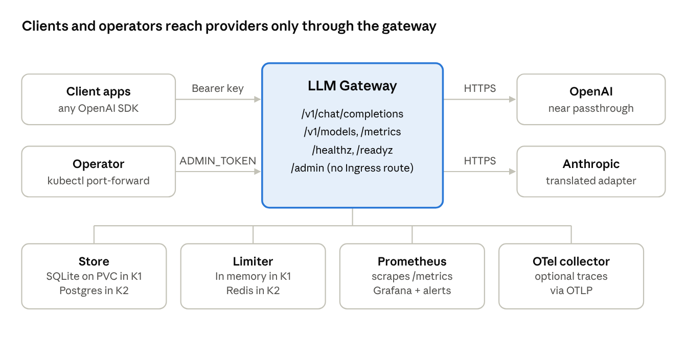
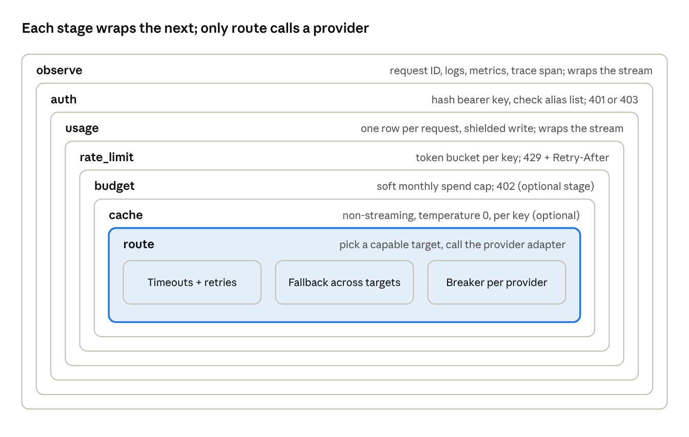
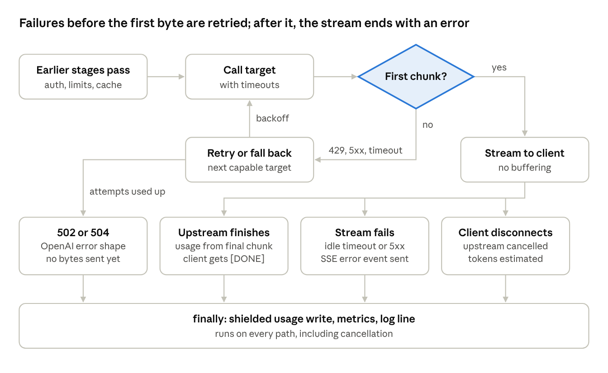
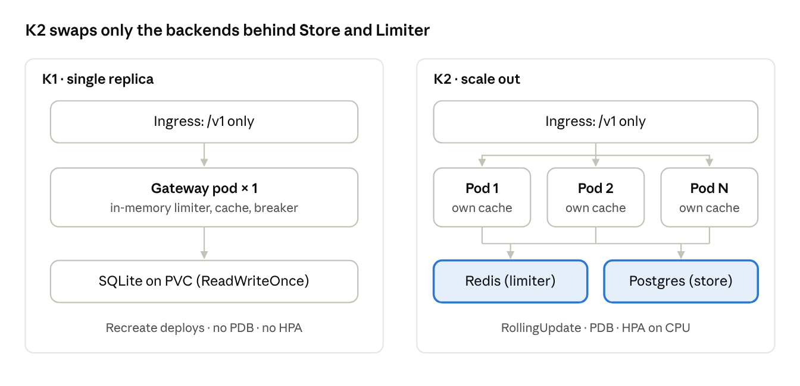
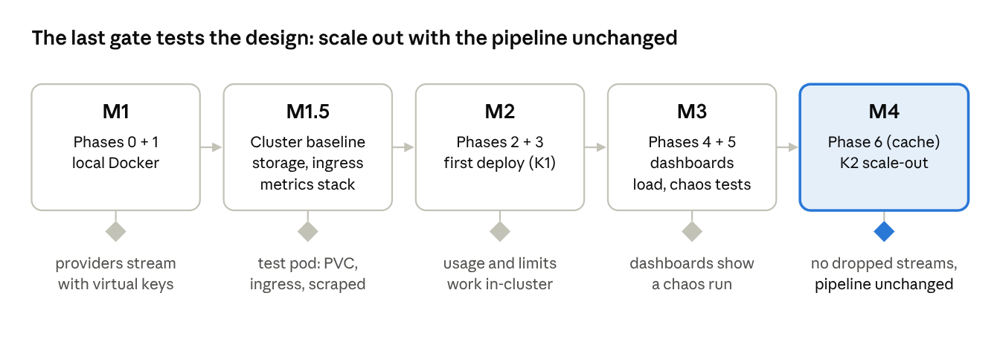

# LLM Gateway: High-Level Design

*Oct 9, 2026 · companion to [SPEC.md](SPEC.md) (v0.2) · editable version: [Claude doc](https://claude.ai/code/artifact/95848d23-9e1f-4244-9978-0342112086ae)*

## Overview

The gateway is one Python service that exposes an OpenAI-compatible `/v1/chat/completions` endpoint and forwards calls to OpenAI or Anthropic. It adds virtual keys, cost tracking, limits, resilience, observability and caching. It is built to learn from, so each concern is a small stage that can be explained in two sentences. The detailed requirements live in [`docs/SPEC.md`](SPEC.md) (v0.2); this document shows how the parts fit.

**Goals**

- Clients use any OpenAI SDK unchanged, streaming or not.
- Every authenticated request is attributed to a key and costed, including cancelled streams.
- A provider outage degrades to a fallback provider instead of failing.
- The service runs on Kubernetes and scales out without changing pipeline code.
- Core code stays under about 2,000 lines, excluding tests.

**Non-goals**

Admin UI, multi-tenancy, plugins, SSO, endpoints other than chat completions, tool-call translation, more than three providers, hot config reload, hard budgets, and hostname-based egress policy.

## System context

Only the gateway holds provider keys: clients and the operator talk to it, and it talks to OpenAI and Anthropic over HTTPS.

- **Client apps** are the programs that consume LLMs through the gateway, using any OpenAI SDK pointed at the gateway's base URL. Each one authenticates with a virtual key (`gw-…`) issued by the operator, never with a real provider key.
- **The operator** is the person who runs the gateway: they deploy it, issue and revoke virtual keys, and check usage through `/admin/*` with the `ADMIN_TOKEN`. `/admin` has no Ingress route, so the operator reaches it in-cluster with `kubectl port-forward`.

The four boxes below the gateway are its dependencies. Store and Limiter are the two that change backends between K1 and K2.

## Architecture and components

The request handler runs a fixed chain of seven stages. Each stage can refuse the request early or call the next one, and the outer stages can wrap the response stream. The order is set in code; config can only switch `budget` and `cache` on or off.

A stage that needs the final result (usage, metrics, logs) wraps the response's async iterator and acts in `finally`. That wrapper is the core technique of the project.

| Component | Module | Depends on | Refuses with |
| --- | --- | --- | --- |
| observe | `stages/observe.py` | `metrics.py`, OTel SDK | — |
| auth | `stages/auth.py` | `Store` | 401, 403 |
| usage | `stages/usage.py` | `Store`, pricing config | — |
| rate_limit | `stages/rate_limit.py` | `Limiter` | 429 |
| budget | `stages/budget.py` | `Store.spend_this_month` | 402 |
| cache | `stages/cache.py` | In-process LRU | — |
| route | `stages/route.py` | `resilience/`, providers | 400, 502, 503, 504 |
| Providers | `providers/openai.py`, `providers/anthropic.py` | httpx | — |
| Store | `store/sqlite.py` (K2: `postgres.py`) | aiosqlite | — |
| Limiter | `limiter/memory.py` (K2: `redis.py`) | — | — |

The internal format is the OpenAI schema. The OpenAI adapter is almost a passthrough. The Anthropic adapter translates the system prompt, `max_tokens`, stop reasons and SSE event types. Requests with `tools` only go to targets whose provider supports tools.

## Request lifecycle

The first byte sent to the client splits every request in two. Before it, the gateway can still retry, fall back or return a proper HTTP error. After it, the status is already 200, so failures end the stream with an SSE error event.

Every path ends in the same `finally`, so each authenticated request gets exactly one usage row.

**Non-streaming** follows the same path, except that the "first chunk" is the whole response body. Only non-streaming responses can be cached, and the cache is checked before route.

**Early refusals** return before any provider is called. 401 and 403 come from auth, which runs before usage, so only metrics and logs record them. 429, 402 and 400 come later and write a usage row with zero cost.

## Data design

The gateway keeps two durable tables (keys and usage) and three kinds of in-process state (limiter buckets, cache, breaker). Only `Store` and `Limiter` implementations touch a backend, which is what lets K2 swap SQLite for Postgres and memory for Redis.

| State | Owner | K1 backend | K2 backend | Lifetime |
| --- | --- | --- | --- | --- |
| Virtual keys (`api_keys`) | `Store` | SQLite on PVC | Postgres | Durable |
| Usage rows (`usage`) | `Store` | SQLite on PVC | Postgres | Durable |
| Rate-limit buckets | `Limiter` | Process memory | Redis (Lua token bucket) | Seconds |
| Response cache | cache stage | Process memory (LRU + TTL) | Process memory, per replica | Minutes |
| Circuit breaker state | route stage | Process memory | Process memory, per replica | Seconds |

**Usage row rules**

- One row per authenticated request, keyed by a unique `request_id`. Failed auth goes to metrics and logs only.
- Retries and fallbacks share the row: `attempts` counts them, `provider` and `model` name the final target.
- Tokens come from the provider's usage data; for a cut-short stream they are estimated and `usage_estimated = 1`.
- Cache hits record `cache_hit = 1` and zero cost.
- The row is written inline when the response finishes, under `asyncio.shield` so cancellation cannot drop it.

**Interfaces**

- `Store`: `get_key_by_hash`, `create_key`, `revoke_key`, `record_usage`, `spend_this_month`, `usage_summary`, `ping`.
- `Limiter`: `acquire(key_id, rpm) -> (allowed, retry_after_s)`.

An index on `usage(key_id, ts)` keeps `spend_this_month` cheap, since it runs on every request.

## Resilience design

The route stage may retry or fall back only until the first byte reaches the client; after that, the response is committed and failures end the stream with an SSE error event. Retries and fallbacks share one budget of 3 attempts.

| Timeout | Default | Covers | On expiry |
| --- | --- | --- | --- |
| Connect | 3 s | TCP + TLS to the provider | Retry or fall back |
| First byte | 20 s | Request sent → first chunk or full body | Retry or fall back |
| Idle | 30 s | Gap between chunks mid-stream | SSE error event, stream closed |
| Total | 300 s | Whole request | 504 before first byte; SSE error after |

**Retries** run on 429, 5xx, connect errors and first-byte timeouts, with full-jitter backoff (`uniform(0, 0.25 × 2^n)` seconds). An upstream `Retry-After` is honored if it fits in the remaining total timeout.

**Fallback** walks the alias's targets in order, skipping any that cannot serve the request (no tool support) or whose breaker is open.

**Circuit breaker**, one per provider:

| State | Behavior | Moves to |
| --- | --- | --- |
| Closed | Calls pass; consecutive failures counted | Open after 5 consecutive failures |
| Open | Target skipped during selection | Half-open after 30 s |
| Half-open | One trial request allowed | Closed on success, Open on failure |

If every target is skipped or exhausted, the client gets 503 (all breakers open) or 502 (all attempts failed).

## Security

The gateway holds the provider keys, so the design keeps them out of files, logs and client reach, and keeps admin access off the public route.

| Concern | Control |
| --- | --- |
| Virtual keys | `gw-` + 32 random URL-safe bytes, shown once; stored as SHA-256 (enough for high-entropy keys) |
| Authentication | Bearer key hashed and looked up; unknown or revoked → 401 |
| Authorization | Per-key alias list → 403; per-key RPM and monthly budget |
| Admin API | Separate `ADMIN_TOKEN`, constant-time compare; virtual keys get 403; no Ingress route for `/admin` |
| Provider secrets | Kubernetes Secret → environment variables; never in the ConfigMap or YAML |
| Logging | Prompts and completions never logged by default; keys never logged |
| Network | NetworkPolicy allows egress to DNS and TCP 443 only (hostname filtering needs an FQDN-aware CNI) |
| Container | Non-root user, read-only root filesystem; only the SQLite volume and `/tmp` are writable |
| Tenant isolation | Cache entries scoped per key, so one key never receives a response generated for another |

## Observability

The outermost `observe` stage owns the request ID and emits all three signals, so every request is visible even when auth rejects it. Per-key detail lives in the usage table, never in metric labels.

| Signal | What | Labels or fields |
| --- | --- | --- |
| Metrics | Requests, latency and TTFT histograms, tokens, cost, errors, in-flight, retries, cache hits, breaker state, auth failures | alias, provider, status class |
| Logs | One JSON line per request | `request_id`, key ID, alias, provider, status, latency, attempts |
| Traces | One span per request, a child span per provider attempt | Off unless `OTEL_EXPORTER_OTLP_ENDPOINT` is set |
| Dashboard | Grafana JSON shipped in `deploy/` | RED panels plus TTFT, cost and breaker state |
| Alerts | Error rate, p95 TTFT | Prometheus rules |

TTFT is the headline latency for streaming: total latency mostly measures output length, while TTFT measures the gateway and the provider.

## Deployment architecture

The gateway ships as one container image and is deployed with Kustomize, using a base plus `k1` and `k2` overlays. K1 is deliberately one replica so SQLite and in-memory state stay correct. K2 moves shared state to Redis and Postgres and changes nothing in the pipeline.

K1 must use `Recreate`: a ReadWriteOnce volume attaches to one node, so a rolling update would leave the new pod waiting for the volume forever. In K2 the cache and breakers stay per pod, which lowers cache hit rate and makes each pod learn about outages on its own.

**Graceful shutdown, in the order Kubernetes runs it**

1. The pod is marked terminating and endpoint removal starts.
2. `preStop` calls the loopback-only `/internal/drain`: the app sets draining, `/readyz` fails, new requests get 503, and the call waits 10 s so the ingress stops sending traffic. This step is what prevents dropped requests.
3. SIGTERM arrives after the hook returns; uvicorn stops accepting connections.
4. Uvicorn waits for in-flight streams for up to `drain_s` (330 s, at least the 300 s total timeout).
5. `terminationGracePeriodSeconds` covers preStop + `drain_s` + a margin, so SIGKILL never cuts a live stream.

**Kubernetes objects**: Deployment, Service, ConfigMap, Secret, NetworkPolicy, Ingress (no `/admin` route), and scrape config. K1 adds a PVC; K2 adds a PDB and an HPA.

## Key decisions and trade-offs

Each decision picks the simpler correct option and writes down what it gives up. Numbers match the decisions log in the spec.

| # | Decision | Gives up | Why accepted |
| --- | --- | --- | --- |
| D1 | Usage written inline, no queue | A few ms of tail latency per request | Correct by construction; revisit only if load tests say so |
| D2 | Admin on the API port | Port-level isolation | Not routing `/admin` publicly provides the isolation |
| D4 | Stage order fixed in code | Reordering through config | Order carries meaning; config only toggles stages |
| D5 | No usage row for failed auth | Table-level view of auth failures | Nothing to attribute it to; metrics cover it |
| D6 | One row per request across retries | Per-attempt cost detail | One request, one bill line, one attempt bound |
| D7 | Tools only to capable providers | Anthropic as a tool-call fallback | Safe fallback without building a translator |
| D8 | Budget is a soft cap | Exact enforcement under concurrency | A hard cap needs reservations; the race is the lesson |
| D9 | Cache per key, explicit `temperature: 0` only | Hit rate | Tenant isolation and correctness |
| D10 | K1 uses Recreate, no PDB or HPA | Zero-downtime deploys in K1 | A ReadWriteOnce volume makes rolling updates hang |
| D11 | Egress limited to DNS + 443 | Per-host egress control | Vanilla NetworkPolicy cannot match hostnames |
| D12 | 2,000-line budget; tracing cut first | A tighter core | Realistic for the feature set |

## Risks, open questions and milestones

The biggest risks are in streaming accounting and provider format drift. Both are covered by named tests and recorded fixtures.

| Risk | Impact | Mitigation |
| --- | --- | --- |
| Usage write lost on cancellation | Keys under-billed | `asyncio.shield` plus a named disconnect test |
| Anthropic SSE format changes | Broken translation | Recorded fixtures replayed in adapter tests |
| Retry storm during a provider outage | Amplified upstream load | 3-attempt cap, full jitter, circuit breaker |
| SQLite write contention under load | Higher latency | Measure in the load test; Postgres in K2 |
| Core outgrows 2,000 lines | Harder to explain | Cut tracing first, then simplify |
| Model IDs or prices change | Wrong costs | Verify at build time; startup check that every model has a price |
| Budget overspend under concurrency | Small overspend per key | Accepted and documented (D8) |

**Resolved questions**

- K2 HPA scales on CPU; in-flight scaling is a stretch (D16).
- `/v1/models` stays stable regardless of breaker state (D17).
- Model IDs and prices are verified when provider API keys are added; until then the config holds placeholders.

**Milestones**

Each milestone closes only when its gate holds and its phase notes are written in `docs/notes/`.
