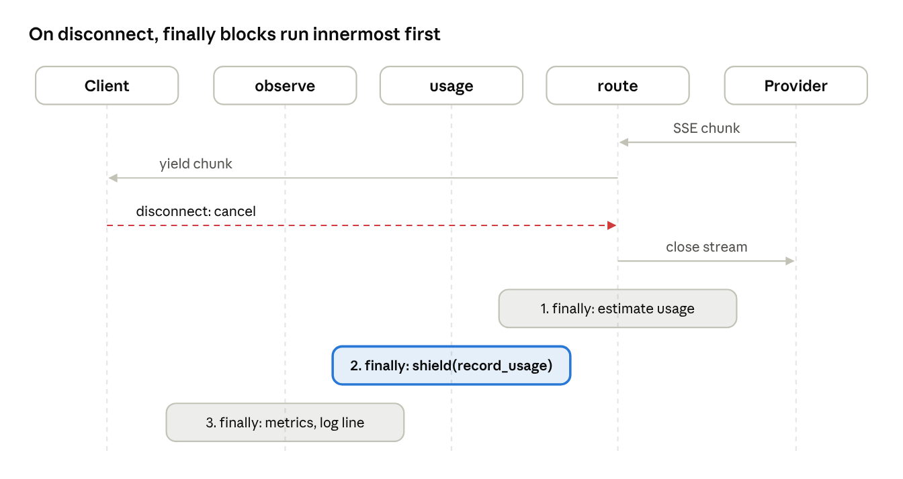
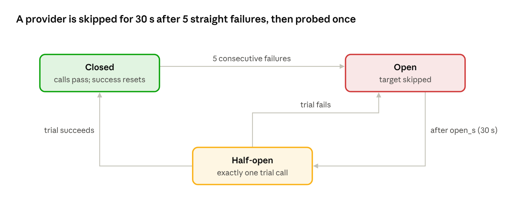

# LLM Gateway: Low-Level Design

*Oct 9, 2026 · companion to [SPEC.md](SPEC.md) and [HLD.md](HLD.md) · editable version: [Claude doc](https://claude.ai/code/artifact/2790d2f0-dd28-4d52-a97c-6fa7fff452dc)*

## Scope, conventions and dependencies

This document specifies classes, functions, algorithms and file layout in enough detail to start coding Phase 0. It follows `docs/SPEC.md` v0.2 and `docs/HLD.md`; where they disagree, the spec wins and this doc gets fixed.

**Runtime and tooling**

| Item | Choice |
| --- | --- |
| Python | 3.12 (`asyncio.timeout`, `TaskGroup`, modern typing) |
| Package manager | uv, one `pyproject.toml` |
| Lint and format | ruff (`ruff check`, `ruff format`) |
| Type check | pyright in basic mode (optional, not a CI gate) |
| Server | `uvicorn gateway.app:app --timeout-graceful-shutdown <drain_s>` |

**Runtime dependencies** (the whole list): `fastapi`, `uvicorn[standard]`, `httpx`, `pydantic`, `pydantic-settings`, `pyyaml`, `aiosqlite`, `prometheus-client`. Tracing adds `opentelemetry-sdk` and `opentelemetry-exporter-otlp`. K2 adds `asyncpg` and `redis`.

**Test dependencies**: `pytest`, `pytest-asyncio`, `respx`, `asgi-lifespan`.

**Module layout**

```
gateway/
  app.py            # create_app(), routes, pipeline list, lifespan
  config.py         # Settings, Config models, load_config(), validate
  context.py        # RequestContext, GatewayResponse, Usage, Target
  schemas.py        # ChatRequest, ChatResponse, ChatChunk (OpenAI shape)
  errors.py         # GatewayError + subclasses, to_openai_error()
  sse.py            # encode_sse(), parse_sse() helpers
  streams.py        # wrap_stream() — the core technique
  pricing.py        # cost_usd(), estimate_tokens()
  metrics.py        # every Prometheus metric, defined once
  admin.py          # /admin router
  providers/        # base.py, openai.py, anthropic.py
  stages/           # observe, auth, usage, rate_limit, budget, cache, route
  resilience/       # timeouts.py, retry.py, breaker.py
  store/            # base.py, sqlite.py, schema.sql
  limiter/          # base.py, memory.py
```

**Coding rules**

- Everything on the request path is `async`; no blocking I/O.
- One shared `httpx.AsyncClient` per provider, created in the app lifespan, never per request.
- Stages never import each other. They share data only through `RequestContext`.
- Raise `GatewayError` subclasses for refusals; one exception handler turns them into OpenAI-shaped JSON.
- Times come from `time.monotonic()` for durations and `datetime.now(UTC)` for stored timestamps.

## Core types

All stages communicate through one mutable `RequestContext` and return one `GatewayResponse`. A response is either a complete JSON body or an async iterator of chunks, never both.

```python
# gateway/context.py
@dataclass(frozen=True)
class Target:
    provider: str            # "openai" | "anthropic"
    model: str               # provider model ID

@dataclass
class Usage:
    input_tokens: int
    output_tokens: int
    estimated: bool = False

@dataclass
class RequestContext:
    request_id: str
    body: ChatRequest
    alias: str                               # == body.model
    bearer: str | None = None                # raw Authorization token; auth clears it
    key: VirtualKey | None = None
    target: Target | None = None
    attempts: int = 0
    started_at: float = field(default_factory=time.monotonic)
    first_byte_at: float | None = None
    usage: Usage | None = None
    cache_mode: str = "default"             # "default" | "bypass", from x-gateway-cache
    cache_hit: bool = False
    status: int = 200
    error: GatewayError | None = None        # set when the stream ends in error
    output_chars: int = 0                    # for token estimation

@dataclass
class GatewayResponse:
    status: int = 200
    body: dict | None = None                       # non-streaming
    stream: AsyncIterator[ChatChunk] | None = None # streaming
    headers: dict[str, str] = field(default_factory=dict)
```

**Schemas** (`gateway/schemas.py`) are Pydantic models with `extra="allow"`, so unknown OpenAI fields pass through untouched.

| Model | Required fields | Notes |
| --- | --- | --- |
| `ChatRequest` | `model`, `messages` | Optional: `stream`, `stream_options`, `temperature`, `max_tokens`, `tools`, `tool_choice`, `stop`, `user` |
| `ChatResponse` | `id`, `object`, `created`, `model`, `choices`, `usage` | `object = "chat.completion"` |
| `ChatChunk` | `id`, `object`, `created`, `model`, `choices` | `object = "chat.completion.chunk"`; `usage` only on the final chunk |

The `model` field in responses is rewritten to the client's alias, so clients never see provider model IDs.

**Errors** (`gateway/errors.py`). Every refusal is a subclass of `GatewayError(status, type, code, message)`. One FastAPI exception handler renders `{"error": {"message", "type", "code"}}`.

| Class | Status | `type` | Extra header |
| --- | --- | --- | --- |
| `BadRequest` | 400 | `invalid_request_error` | — |
| `Unauthorized` | 401 | `authentication_error` | — |
| `BudgetExceeded` | 402 | `insufficient_quota` | — |
| `Forbidden` | 403 | `permission_error` | — |
| `RateLimited` | 429 | `rate_limit_error` | `Retry-After` |
| `UpstreamFailed` | 502 | `api_error` | — |
| `Unavailable` | 503 | `api_error` | `Retry-After` (draining) |
| `UpstreamTimeout` | 504 | `timeout_error` | — |

Upstream errors are classified by `ProviderError(kind, status, retry_after)`, where `kind` is `connect`, `timeout_first_byte`, `timeout_idle`, `http` or `protocol`. Only route decides whether one becomes a retry or a client-facing `GatewayError`.

## Request handler and pipeline assembly

The chain is built once at startup from a fixed list in `app.py`. Each stage is a plain object with `async __call__(ctx, call_next)`. Adding a feature means adding one line to the list.

```python
# gateway/stages/base.py
Next = Callable[[RequestContext], Awaitable[GatewayResponse]]

class Stage(Protocol):
    async def __call__(self, ctx: RequestContext, call_next: Next) -> GatewayResponse: ...

def build_chain(stages: list[Stage], terminal: Next) -> Next:
    handler = terminal
    for stage in reversed(stages):
        handler = functools.partial(stage, call_next=handler)   # outermost first
    return lambda ctx: handler(ctx)
```

```python
# gateway/app.py (shape, not final code)
def create_app(cfg: Config) -> FastAPI:
    deps = Deps.from_config(cfg)           # store, limiter, providers, breakers, cache
    stages = [
        Observe(deps.metrics),
        Auth(deps.store),
        UsageStage(deps.store, cfg.pricing),
        RateLimit(deps.limiter),
        *([Budget(deps.store)] if cfg.stages.budget.enabled else []),
        *([Cache(cfg.stages.cache)] if cfg.stages.cache.enabled else []),
    ]
    chain = build_chain(stages, terminal=Route(deps))

    @app.post("/v1/chat/completions")
    async def chat(request: Request) -> Response:
        if deps.draining:
            raise Unavailable("draining")
        body = ChatRequest.model_validate(await request.json())   # 400 on failure
        if body.model not in cfg.models:
            raise BadRequest(f"unknown model {body.model!r}", code="model_not_found")
        ctx = RequestContext(request_id=request_id_from(request), body=body, alias=body.model)
        ctx.bearer = bearer_from(request)
        resp = await chain(ctx)
        return to_http(resp, ctx)
```

The terminal handler is `Route`; it is the only component that calls a provider.

**`to_http(resp, ctx)`** converts the result:

- `resp.body` → `JSONResponse(resp.body, status_code=resp.status)`.
- `resp.stream` → `StreamingResponse(sse_bytes(resp.stream), media_type="text/event-stream")`, where `sse_bytes` yields `data: <json>\n\n` per chunk and `data: [DONE]\n\n` at the end.
- Always adds `x-request-id`, plus `x-gateway-cache` when the cache stage set it.
- Streaming responses also set `Cache-Control: no-cache` and `X-Accel-Buffering: no` so proxies do not buffer.

**Request IDs.** A valid incoming `x-request-id` (1–64 characters from `[A-Za-z0-9._-]`) is reused; otherwise `req_` + 24 hex characters from `secrets.token_hex(12)`.

**Client disconnect.** Starlette's `StreamingResponse` watches for `http.disconnect` and cancels the task that is iterating the body. The cancellation reaches the innermost provider generator, which closes the httpx stream. Every wrapper's `finally` runs on the way out (next section).

## The stream wrapper

`wrap_stream` is one helper that every stage uses to observe a stream without buffering it. It yields each chunk as it arrives, and its `finally` runs exactly once whether the stream completed, failed or was cancelled.

```python
# gateway/streams.py
Outcome = Literal["completed", "error", "cancelled"]

async def wrap_stream(
    source: AsyncIterator[StreamItem],
    on_item: Callable[[StreamItem], None] | None,
    on_close: Callable[[Outcome], Awaitable[None]],
) -> AsyncIterator[StreamItem]:
    outcome: Outcome = "completed"
    try:
        async for item in source:
            if on_item:
                on_item(item)          # cheap, synchronous bookkeeping only
            yield item
    except (asyncio.CancelledError, GeneratorExit):
        outcome = "cancelled"
        raise
    except Exception:
        outcome = "error"
        raise
    finally:
        await shielded(on_close(outcome))
```

```python
_background: set[asyncio.Task] = set()

async def shielded(coro: Awaitable[None]) -> None:
    """Run coro to completion even if the caller is cancelled."""
    task = asyncio.ensure_future(coro)
    _background.add(task)                      # keep a reference so it is not GC'd
    task.add_done_callback(_background.discard)
    await asyncio.shield(task)

async def drain_background(timeout: float) -> None:  # called at shutdown
    if _background:
        await asyncio.wait(_background, timeout=timeout)
```



Wrappers nest in stage order, so on the way out the innermost `finally` runs first. Route records usage on the context before usage's wrapper writes the row, and observe sees the final status last.

**Stream items.** A stream yields `StreamItem = ChatChunk | StreamError`. When route hits a failure after the first byte, it sets `ctx.status` and `ctx.error`, yields one `StreamError`, and returns normally. `sse_bytes` encodes a `StreamError` as `data: {"error": {...}}` and then stops without `[DONE]`. Because route ends the stream cleanly, outer wrappers see `completed` and read the failure from `ctx`, not from an exception.

**Rules for `on_close`**

- Never raise. Catch and log everything, because an exception in `finally` would hide the original one.
- Read the final state from `ctx`; never from local variables captured before the stream started.
- Keep it short. A slow `on_close` delays the client's connection close; a usage insert takes about 1 ms on SQLite.

## Stages

Each stage below lists what it reads from and writes to the context, and its logic. Every stage file stays under about 100 lines; route is the exception and splits its helpers into `resilience/`.

| Stage | Reads | Writes | Refuses |
| --- | --- | --- | --- |
| observe | everything, at the end | `metrics`, log, span | — |
| auth | `bearer`, `alias` | `key`; clears `bearer` | 401, 403 |
| usage | `key`, `target`, `usage`, `status`, `cache_hit` | one `usage` row | — |
| rate\_limit | `key.rpm_limit` | — | 429 |
| budget | `key.monthly_budget_usd` | — | 402 |
| cache | `body`, `key`, `cache_mode` | `cache_hit`, `usage` | — |
| route | `body`, `alias` | `target`, `attempts`, `first_byte_at`, `usage`, `status`, `error`, `output_chars` | 400, 502, 503, 504 |

### observe

```python
async def __call__(self, ctx, call_next):
    m.in_flight.inc()
    span = tracing.start_request_span(ctx)          # no-op when tracing is off
    try:
        resp = await call_next(ctx)
    except GatewayError as e:
        ctx.status = e.status
        self.finish(ctx, span); raise
    except Exception:
        ctx.status = 500
        self.finish(ctx, span); raise
    if resp.stream is None:
        ctx.status = resp.status
        self.finish(ctx, span); return resp
    resp.stream = wrap_stream(resp.stream, None, lambda _: self.finish_async(ctx, span))
    return resp
```

`finish` decrements `in_flight` exactly once, then records request count, latency, TTFT (if `first_byte_at`), tokens, cost and the status class. It also writes one JSON log line and ends the span. Rejections raised in the handler before the chain runs (malformed JSON, unknown alias, draining) are counted by the exception handler in `gateway_rejected_total{reason}`.

### auth

1. No bearer token → `Unauthorized`.
2. `h = sha256(token).hexdigest()`; `key = await store.get_key_by_hash(h)`.
3. `key is None` or `key.revoked_at` set → `Unauthorized`. Both cases return the same message, so callers cannot tell which keys exist.
4. `key.allowed_models` set and `ctx.alias` not in it → `Forbidden`.
5. Set `ctx.key`, set `ctx.bearer = None`, call next.

The lookup hits the store on every request. That is fine for SQLite (an indexed lookup on a local file); add a 30-second in-process cache only if a load test shows it matters.

### usage

```python
async def __call__(self, ctx, call_next):
    try:
        resp = await call_next(ctx)
    except GatewayError as e:
        ctx.status = e.status
        await shielded(self.record(ctx)); raise
    if resp.stream is None:
        ctx.status = resp.status
        await shielded(self.record(ctx)); return resp
    resp.stream = wrap_stream(resp.stream, None, lambda outcome: self.record_stream(ctx, outcome))
    return resp
```

- `record_stream` sets `ctx.status = 499` when the outcome is `cancelled` (the nginx convention for "client closed request"), then calls `record`.
- `record` fills `ctx.usage` by estimation when it is missing and a provider was called. Input tokens come from `estimate_tokens(body.messages)` and output tokens from `ctx.output_chars // 4`, with `estimated = True`.
- Cost is `0` when `cache_hit` or when no target was called; otherwise `pricing.cost_usd(ctx.target.model, ctx.usage)`.
- Builds one `UsageRow` and calls `store.record_usage`. Any exception is logged with the request ID and counted in `gateway_usage_write_failures_total`, never raised.

### rate\_limit

```python
if ctx.key.rpm_limit is not None:
    allowed, retry_after = await limiter.acquire(ctx.key.id, ctx.key.rpm_limit)
    if not allowed:
        raise RateLimited(retry_after=math.ceil(retry_after))
return await call_next(ctx)
```

### budget

```python
if ctx.key.monthly_budget_usd is not None:
    spent = await store.spend_this_month(ctx.key.id)
    if spent >= ctx.key.monthly_budget_usd:
        raise BudgetExceeded(f"monthly budget of ${ctx.key.monthly_budget_usd:.2f} used")
return await call_next(ctx)
```

This is a soft cap (spec D8): two concurrent requests can both pass the check. The month is the current UTC calendar month.

### cache

- **Eligible** when `not body.stream`, `body.temperature == 0` (explicitly set; the field defaults to `None`), and `ctx.cache_mode != "bypass"`. The handler sets `cache_mode` from the `x-gateway-cache` request header.
- **Key**: `sha256(key_id + "\n" + alias + "\n" + canonical_json(body))`, where `canonical_json` drops `stream`, `stream_options` and `user`, then dumps with `sort_keys=True, separators=(",", ":")`.
- **Store**: `OrderedDict[str, (expires_at, body, usage)]`. A hit calls `move_to_end`; an insert evicts from the front past `max_entries`; an expired entry counts as a miss and is deleted.
- **Hit**: set `ctx.cache_hit = True` and `ctx.usage` from the stored entry, then return a copy of the body with a fresh `id`. The header is `x-gateway-cache: hit`.
- **Miss**: call next. Store the result only when the status is 200 and it has a body. The header is `x-gateway-cache: miss`, or `bypass` when the client asked to skip.

### route

Route picks targets, runs the attempt loop and turns provider output into a `GatewayResponse`. Its key design point: **for streams it waits for the first chunk before returning**. Until the first chunk arrives, nothing has been sent, so a failure can still become a retry or a proper 502/504.

```python
async def __call__(self, ctx):
    targets = [t for t in self.cfg.models[ctx.alias].targets if self.capable(t, ctx.body)]
    if not targets:
        raise BadRequest("no target for this model supports the request (tools)")
    if ctx.body.stream:
        first, upstream = await self.attempts.open_stream(ctx, targets)  # retries happen here
        return GatewayResponse(stream=self.relay(ctx, first, upstream))
    body = await self.attempts.complete(ctx, targets)                    # and here
    return GatewayResponse(body=body)
```

`capable(t, body)` is false when `body.tools` is set and the provider has `supports_tools = False`. `relay` and the attempt loop are specified in the resilience section.

## Provider adapters

An adapter turns a `ChatRequest` into one provider's HTTP call and turns the reply back into OpenAI-shaped objects. Adapters do no retries, no timing policy and no usage bookkeeping; those belong to route.

```python
# gateway/providers/base.py
class Provider(Protocol):
    name: str
    supports_tools: bool
    async def complete(self, req: ChatRequest, model: str) -> ChatResponse: ...
    def stream(self, req: ChatRequest, model: str) -> AsyncIterator[ChatChunk]: ...

@dataclass
class ProviderError(Exception):
    kind: Literal["connect", "timeout_first_byte", "timeout_idle", "http", "protocol"]
    status: int | None = None
    retry_after: float | None = None
    message: str = ""
```

**Shared HTTP behavior.** Each adapter owns one `httpx.AsyncClient(base_url, timeout=httpx.Timeout(connect=cfg.connect_s, read=None, write=10, pool=5))`. The read timeout is `None` because route enforces the first-byte and idle timeouts itself. Errors map as follows:

| httpx outcome | `ProviderError.kind` |
| --- | --- |
| `ConnectError`, `ConnectTimeout` | `connect` |
| Response status ≥ 400 | `http`, with `status` and parsed `Retry-After` |
| Malformed JSON or SSE, unknown event | `protocol` |

### SSE parsing

`parse_sse(response.aiter_lines())` yields `SSEEvent(event: str | None, data: str)`. Lines starting with `event:` set the event name, `data:` lines are joined with `\n`, a blank line emits the event, and lines starting with `:` are comments and are skipped. It is about 25 lines and has its own unit tests.

### OpenAI adapter

- `complete`: `POST /chat/completions` with the body as sent, `model` replaced by the target model, and `Authorization: Bearer <key>`.
- `stream`: same request with `stream: true` and **always** `stream_options: {"include_usage": true}`. Each `data:` line is parsed into a `ChatChunk`; `data: [DONE]` ends the iterator.
- `supports_tools = True`. Tool fields pass through untouched in both directions.

### Anthropic adapter

`POST /v1/messages` with headers `x-api-key` and `anthropic-version: 2023-06-01`. `supports_tools = False` in v1.

**Request translation**

| OpenAI field | Anthropic field |
| --- | --- |
| `messages` with role `system` | Top-level `system`, joined with blank lines |
| `messages` user/assistant, string content | Same roles and content |
| Content parts of type `text` | `{"type": "text", "text": ...}` blocks |
| Content parts of any other type | Refused: `BadRequest` before the call |
| `max_tokens` or `max_completion_tokens` | `max_tokens`; `providers.anthropic.default_max_tokens` when absent |
| `temperature` (0–2) | `temperature` (0–1); values above 1 are clamped to 1 |
| `top_p` | `top_p` |
| `stop` (string or list) | `stop_sequences` (list) |
| `user` | `metadata.user_id` |
| `model` | Target model ID |

**Response translation**

| Anthropic | OpenAI |
| --- | --- |
| `id` | `id` |
| `content[*].text`, concatenated | `choices[0].message.content` |
| `stop_reason` `end_turn` or `stop_sequence` | `finish_reason: "stop"` |
| `stop_reason` `max_tokens` | `finish_reason: "length"` |
| `usage.input_tokens`, `usage.output_tokens` | `usage.prompt_tokens`, `usage.completion_tokens`, `usage.total_tokens` |

**Stream event translation**

| Anthropic event | Adapter action |
| --- | --- |
| `message_start` | Remember `id` and `usage.input_tokens`; yield a chunk with `delta: {"role": "assistant"}` |
| `content_block_start`, `content_block_stop`, `ping` | Ignore |
| `content_block_delta` (`text_delta`) | Yield a chunk with `delta: {"content": text}` |
| `message_delta` | Remember `usage.output_tokens`; yield a chunk with the mapped `finish_reason` |
| `message_stop` | Yield one final chunk with `choices: []` and `usage`, then stop |
| `error` | Raise `ProviderError(kind="http", status=529 if overloaded else 500)` |

Both adapters therefore end a stream the same way: a usage-only chunk with empty `choices`. Route's relay records it and drops it unless the client asked for `stream_options.include_usage`.

## Resilience internals

All resilience logic lives in `resilience/` and is called only by route. Every wait is bounded by one request deadline, `ctx.started_at + timeouts.total_s`, so no combination of retries and slow chunks can outlive the total timeout.

### Timeouts

| Timeout | Enforced by | Raises |
| --- | --- | --- |
| Connect | `httpx.Timeout(connect=connect_s)` | `ProviderError("connect")` |
| First byte | `async with asyncio.timeout(min(first_byte_s, remaining))` around the first `anext()` or `complete()` | `ProviderError("timeout_first_byte")` |
| Idle | `asyncio.timeout(min(idle_s, remaining))` around every later `anext()` | `ProviderError("timeout_idle")` |
| Total | `remaining = deadline - time.monotonic()` used in every wait and every backoff sleep | Whichever of the above fires first |

### Attempt loop

Targets are tried in a fixed rotation: attempt *n* uses `available[n % len(available)]`, where `available` is recomputed each attempt as the capable targets whose breaker allows a call. With one target this is a plain retry; with two it goes primary, fallback, primary.

```python
# gateway/resilience/retry.py
async def open_stream(self, ctx, targets):
    deadline = ctx.started_at + self.t.total_s
    last: ProviderError | None = None
    for n in range(self.r.max_attempts):
        available = [t for t in targets if self.breakers[t.provider].can_try()]
        if not available:
            raise Unavailable("all providers are failing; try again shortly")
        target = available[n % len(available)]
        ctx.target, ctx.attempts = target, n + 1
        self.breakers[target.provider].begin()          # claims the half-open trial slot
        upstream = self.providers[target.provider].stream(ctx.body, target.model)
        try:
            async with asyncio.timeout(min(self.t.first_byte_s, deadline - now())):
                first = await anext(upstream)
            ctx.first_byte_at = now()
            return first, upstream
        except TimeoutError:
            last = ProviderError("timeout_first_byte")
        except ProviderError as e:
            last = e
        finally-on-failure: await upstream.aclose()
        self.breakers[target.provider].record(last)     # failure, success or release, per the table
        if not retryable(last):
            raise to_gateway_error(last)
        await self.backoff(n, last, deadline)            # raises if no time is left
    raise to_gateway_error(last)
```

`complete` is the same loop with `provider.complete` under the first-byte timeout. (`finally-on-failure` is shorthand: close the upstream generator on every path except the successful return.)

**Classification**

| Upstream result | Retry? | Breaker records | Client sees if final |
| --- | --- | --- | --- |
| Connect error | Yes | Failure | 502 |
| First-byte timeout | Yes | Failure | 504 |
| HTTP 429 | Yes, honoring `Retry-After` | Release (neutral) | 502 |
| HTTP 5xx, 529 | Yes | Failure | 502 |
| HTTP 400, 404, 422 | No | Success (the provider answered) | 400 with the provider's message |
| HTTP 401, 403 | No | Success | 502 (gateway misconfigured; logged at error level) |
| Protocol error | No | Failure | 502 |

**Backoff.** `delay = retry_after if retry_after else random.uniform(0, backoff_base_s * 2**n)`. If `delay` exceeds the time left before the deadline, the loop stops and raises the last error.

### Relay (after the first byte)

```python
async def relay(self, ctx, first, upstream):
    deadline = ctx.started_at + self.t.total_s
    wants_usage = bool((ctx.body.stream_options or {}).get("include_usage"))
    breaker, outcome = self.breakers[ctx.target.provider], None
    item = first
    try:
        while True:
            if item.usage:
                ctx.usage = Usage(item.usage.prompt_tokens, item.usage.completion_tokens)
            ctx.output_chars += content_chars(item)
            if item.choices or wants_usage:
                yield item.with_model(ctx.alias)
            try:
                async with asyncio.timeout(min(self.t.idle_s, deadline - now())):
                    item = await anext(upstream)
            except StopAsyncIteration:
                outcome = "ok"; break
    except (TimeoutError, ProviderError) as e:
        outcome = "failed"
        err = UpstreamTimeout() if isinstance(e, TimeoutError) or e.kind.startswith("timeout") else UpstreamFailed()
        ctx.status, ctx.error = err.status, err
        yield StreamError(err)
    finally:
        await upstream.aclose()
        if outcome == "ok": breaker.record_success()
        elif outcome == "failed": breaker.record_failure()
        else: breaker.release()   # client cancelled: says nothing about the provider
```

### Circuit breaker



```python
# gateway/resilience/breaker.py
class Breaker:
    def __init__(self, threshold: int, open_s: float): ...
    state: Literal["closed", "open", "half_open"] = "closed"
    failures = 0; opened_at = 0.0; trial_in_flight = False

    def can_try(self) -> bool:                 # pure check, used to build `available`
        if self.state == "open" and now() - self.opened_at >= self.open_s:
            self.state, self.trial_in_flight = "half_open", False
        if self.state == "half_open":
            return not self.trial_in_flight
        return self.state == "closed"

    def begin(self) -> None:                   # called only for the chosen target
        if self.state == "half_open":
            self.trial_in_flight = True

    def record_success(self) -> None:
        self.state, self.failures, self.trial_in_flight = "closed", 0, False

    def record_failure(self) -> None:
        self.failures += 1
        if self.state == "half_open" or self.failures >= self.threshold:
            self.state, self.opened_at, self.trial_in_flight = "open", now(), False

    def release(self) -> None:                 # neutral outcome: free the trial slot
        self.trial_in_flight = False

    def record(self, err: ProviderError) -> None:  # maps the classification table
        ...
```

The breaker needs no lock: asyncio runs one coroutine at a time, and none of these methods await. One `Breaker` exists per provider, created at startup. Each state change sets the `gateway_breaker_state` gauge (0 closed, 1 half-open, 2 open).

## Storage and limiter

The Store is the only code that runs SQL, and the Limiter is the only code that holds rate-limit state. Both are small classes behind a Protocol, so K2 adds a second implementation without touching any caller.

### Schema (`store/schema.sql`)

```sql
PRAGMA journal_mode = WAL;          -- readers never block the single writer
PRAGMA busy_timeout = 5000;
PRAGMA foreign_keys = ON;

CREATE TABLE IF NOT EXISTS api_keys (
  id TEXT PRIMARY KEY,               -- "key_" + 16 hex
  hash TEXT UNIQUE NOT NULL,         -- sha256 hex of the plaintext key
  name TEXT NOT NULL,
  allowed_models TEXT,               -- JSON array of aliases, NULL = all
  rpm_limit INTEGER,
  monthly_budget_usd REAL,
  created_at TEXT NOT NULL,
  revoked_at TEXT
);

CREATE TABLE IF NOT EXISTS usage (
  id INTEGER PRIMARY KEY,
  request_id TEXT UNIQUE NOT NULL,
  key_id TEXT NOT NULL REFERENCES api_keys(id),
  ts TEXT NOT NULL,
  model_alias TEXT NOT NULL,
  provider TEXT,
  model TEXT,
  attempts INTEGER NOT NULL DEFAULT 0,
  input_tokens INTEGER,
  output_tokens INTEGER,
  usage_estimated INTEGER NOT NULL DEFAULT 0,
  cost_usd REAL NOT NULL DEFAULT 0,
  latency_ms INTEGER,
  ttft_ms INTEGER,
  status INTEGER NOT NULL,
  cache_hit INTEGER NOT NULL DEFAULT 0
);

CREATE INDEX IF NOT EXISTS usage_key_ts ON usage (key_id, ts);
PRAGMA user_version = 1;
```

All timestamps are UTC strings in one fixed format, `YYYY-MM-DDTHH:MM:SS.ffffffZ`, so string comparison sorts by time. The schema is applied at startup. A future change bumps `user_version` and adds a numbered migration function; there is no migration framework.

### SqliteStore

One `aiosqlite` connection is opened in the app lifespan. aiosqlite runs it on its own thread and serializes calls, which is enough for one replica.

| Method | SQL |
| --- | --- |
| `get_key_by_hash(h)` | `SELECT * FROM api_keys WHERE hash = ?` |
| `create_key(...)` | Generate `id` and the plaintext key, `INSERT` the hash; return `(VirtualKey, plaintext)` |
| `revoke_key(id)` | `UPDATE api_keys SET revoked_at = ? WHERE id = ? AND revoked_at IS NULL`; return `rowcount == 1` |
| `record_usage(row)` | `INSERT ... ON CONFLICT(request_id) DO NOTHING`, then commit |
| `spend_this_month(key_id)` | `SELECT COALESCE(SUM(cost_usd), 0) FROM usage WHERE key_id = ? AND ts >= ?`, with the first instant of the current UTC month |
| `usage_summary(key_id)` | Same filter, `GROUP BY model_alias`, summing requests, tokens and cost |
| `ping()` | `SELECT 1` |

`ON CONFLICT DO NOTHING` makes the usage write idempotent, so a write that runs twice cannot double-bill.

### Token bucket (`limiter/memory.py`)

Each key gets a bucket that holds up to `rpm` tokens and refills at `rpm / 60` tokens per second. A request takes one token. A new key starts full, so it may burst up to `rpm` requests at once.

```python
class MemoryLimiter:
    def __init__(self):
        self.buckets: dict[str, tuple[float, float]] = {}   # key_id -> (tokens, updated_at)

    async def acquire(self, key_id: str, rpm: int) -> tuple[bool, float]:
        now, rate = time.monotonic(), rpm / 60
        tokens, updated = self.buckets.get(key_id, (float(rpm), now))
        tokens = min(float(rpm), tokens + (now - updated) * rate)
        if tokens >= 1:
            self.buckets[key_id] = (tokens - 1, now)
            return True, 0.0
        self.buckets[key_id] = (tokens, now)
        return False, (1 - tokens) / rate                  # seconds until one token exists
```

No lock is needed because nothing in `acquire` awaits. The K2 `RedisLimiter` runs the same arithmetic inside one Lua script, keyed `rl:{key_id}`, using Redis `TIME` and a 120-second expiry. That makes the check-and-take atomic across replicas, which a GET followed by a SET would not be.

## Config models and startup validation

Configuration has two sources: environment variables for secrets and deployment knobs, and one YAML file for behavior. Both are parsed into frozen Pydantic models at startup, and any error stops the process before it serves traffic.

**Environment** (`Settings(BaseSettings)`)

| Variable | Default | Purpose |
| --- | --- | --- |
| `GATEWAY_CONFIG` | `/etc/gateway/config.yaml` | Path to the YAML file |
| `GATEWAY_DB_PATH` | `/data/gateway.db` | SQLite file (on the PVC) |
| `ADMIN_TOKEN` | required | Admin API token, at least 32 characters |
| `OPENAI_API_KEY`, `ANTHROPIC_API_KEY` | required if referenced | Named by `api_key_env` in the YAML |
| `OTEL_EXPORTER_OTLP_ENDPOINT` | unset | Tracing is on only when set |
| `LOG_LEVEL` | `INFO` | Root log level |

**YAML models** (`gateway/config.py`), all with `model_config = ConfigDict(frozen=True, extra="forbid")` so a typo in a key fails loudly:

```python
class ProviderCfg(BaseModel):
    base_url: HttpUrl
    api_key_env: str
    default_max_tokens: int = 1024           # used by the Anthropic adapter

class TargetCfg(BaseModel):
    provider: str
    model: str

class ModelCfg(BaseModel):
    targets: list[TargetCfg] = Field(min_length=1)

class Price(BaseModel):
    input: float = Field(ge=0)               # USD per 1M tokens
    output: float = Field(ge=0)

class CacheCfg(BaseModel):
    enabled: bool = True
    max_entries: int = Field(1000, gt=0)
    ttl_s: float = Field(300, gt=0)

class StagesCfg(BaseModel):
    cache: CacheCfg = CacheCfg()
    budget: Toggle = Toggle(enabled=True)

class Timeouts(BaseModel):
    connect_s: float = 3; first_byte_s: float = 20; idle_s: float = 30; total_s: float = 300

class Retries(BaseModel):
    max_attempts: int = Field(3, ge=1, le=5); backoff_base_s: float = 0.25

class BreakerCfg(BaseModel):
    failure_threshold: int = Field(5, ge=1); open_s: float = Field(30, gt=0)

class Config(BaseModel):
    providers: dict[Literal["openai", "anthropic"], ProviderCfg]
    models: dict[str, ModelCfg]
    pricing: dict[str, Price]
    stages: StagesCfg = StagesCfg()
    timeouts: Timeouts = Timeouts()
    retries: Retries = Retries()
    breaker: BreakerCfg = BreakerCfg()
    shutdown: ShutdownCfg = ShutdownCfg()    # drain_s: float = 330

    @model_validator(mode="after")
    def cross_checks(self) -> "Config": ...
```

**Cross-checks** in `cross_checks` and `load_config`. Each failure names the YAML path.

1. Every `models.*.targets[*].provider` is a key of `providers`.
2. Every target `model` has an entry in `pricing`.
3. Every provider's `api_key_env` is set and non-empty in the environment.
4. `shutdown.drain_s >= timeouts.total_s`.
5. `timeouts.first_byte_s <= timeouts.total_s` and `timeouts.idle_s <= timeouts.total_s`.
6. Alias names match `^[a-z0-9][a-z0-9._-]{0,63}$`.

`pricing.cost_usd(model, usage) = (usage.input_tokens * p.input + usage.output_tokens * p.output) / 1_000_000`, rounded to 6 decimal places. `estimate_tokens(messages)` returns the total character count of all text content divided by 4, rounded up, plus 4 per message for role overhead. The estimate is rough on purpose, and every row that uses it is flagged.

## Admin API, probes and shutdown

### Admin API (`gateway/admin.py`)

All `/admin` routes depend on `require_admin`, which checks the bearer token in this order:

1. Missing token → 401.
2. Token starts with `gw-` (a virtual key) → 403. This is the case the spec's named test covers.
3. `hmac.compare_digest(token, settings.admin_token)` is false → 401.

| Route | Request body | Success | Errors |
| --- | --- | --- | --- |
| `POST /admin/keys` | `{name, allowed_models?, rpm_limit?, monthly_budget_usd?}` | 201 `{id, key, name, allowed_models, rpm_limit, monthly_budget_usd, created_at}` | 400 for an unknown alias in `allowed_models` |
| `GET /admin/keys/{id}/usage` | — | 200 `{key_id, month, requests, input_tokens, output_tokens, cost_usd, by_alias: [...]}` | 404 |
| `DELETE /admin/keys/{id}` | — | 204 | 404 if unknown or already revoked |

**Key generation.** `id = "key_" + secrets.token_hex(8)` and `key = "gw-" + secrets.token_urlsafe(32)`. Only `sha256(key).hexdigest()` is stored. The plaintext `key` appears in the 201 response once and nowhere else, including logs.

### Probes

- `GET /healthz` always returns 200 `{"status": "ok"}`. It never touches dependencies, so a slow database cannot make Kubernetes restart a healthy process.
- `GET /readyz` returns 503 when `deps.draining` is true or `store.ping()` fails or takes longer than 1 s; otherwise 200.

### Graceful shutdown

The draining flag is set from `preStop`, not from SIGTERM. Uvicorn owns SIGTERM handling, so hooking it is fragile; an explicit drain call is simpler to test.

```yaml
# deploy/base/deployment.yaml (excerpt)
terminationGracePeriodSeconds: 360          # 10 drain delay + 330 drain_s + 20 margin
containers:
  - name: gateway
    command: ["uvicorn", "gateway.app:app", "--host", "0.0.0.0", "--port", "8080",
              "--timeout-graceful-shutdown", "330"]
    lifecycle:
      preStop:
        exec:
          command: ["python", "-c",
            "import urllib.request; urllib.request.urlopen(urllib.request.Request('http://127.0.0.1:8080/internal/drain', method='POST'), timeout=30)"]
```

1. **preStop** calls `POST /internal/drain` over loopback. The route returns 404 unless `request.client.host == "127.0.0.1"`. It sets `draining = True` and sleeps 10 s before answering, so the ingress has time to drop the pod while `/readyz` already fails.
2. **While draining**, new chat requests get 503 with `Retry-After: 1`, and in-flight streams continue.
3. **SIGTERM** arrives after the hook returns. Uvicorn stops accepting connections and waits up to 330 s for open requests.
4. **Lifespan shutdown** runs `drain_background(5)` so pending usage writes finish, then closes the httpx clients and the store.

Spec section 8.2 and decision D13 describe this sequence.

## Metrics catalogue

Every metric is defined once in `gateway/metrics.py` with the `gateway_` prefix. Labels come only from the closed sets below, so the series count is bounded by aliases × providers × models × 5 status classes.

| Metric | Type | Labels | Updated by |
| --- | --- | --- | --- |
| `gateway_requests_total` | Counter | `alias`, `provider`, `status_class` | observe |
| `gateway_request_duration_seconds` | Histogram | `alias`, `provider` | observe |
| `gateway_ttft_seconds` | Histogram | `alias`, `provider` | observe |
| `gateway_in_flight_requests` | Gauge | — | observe |
| `gateway_tokens_total` | Counter | `alias`, `provider`, `direction` (`input`/`output`) | observe |
| `gateway_cost_usd_total` | Counter | `alias`, `provider` | observe |
| `gateway_rejected_total` | Counter | `reason` (`bad_request`, `unknown_model`, `draining`) | exception handler |
| `gateway_auth_failures_total` | Counter | `reason` (`missing`, `invalid`, `forbidden_model`) | auth |
| `gateway_rate_limited_total` | Counter | — | rate\_limit |
| `gateway_budget_exceeded_total` | Counter | — | budget |
| `gateway_cache_requests_total` | Counter | `result` (`hit`, `miss`, `bypass`) | cache |
| `gateway_upstream_attempts_total` | Counter | `provider`, `outcome` (`ok`, `retryable`, `fatal`) | route |
| `gateway_breaker_state` | Gauge | `provider` (0 closed, 1 half-open, 2 open) | breaker |
| `gateway_usage_write_failures_total` | Counter | — | usage |
| `gateway_usage_estimated_total` | Counter | — | usage |

**Buckets.** Duration: 0.1, 0.25, 0.5, 1, 2.5, 5, 10, 30, 60, 120, 300 s. TTFT: 0.05, 0.1, 0.25, 0.5, 1, 2, 5, 10, 20 s.

**Label values.** `provider` is `"none"` when no provider was called (cache hit or early refusal). `status_class` is `2xx`, `4xx` or `5xx`, plus `499` for client disconnects.

## Test plan

There are three layers: unit tests with fake `call_next`, adapter tests against recorded provider streams, and integration tests against a fake upstream over real sockets. Integration tests use real servers because httpx's `ASGITransport` buffers response bodies, which would hide exactly the streaming behavior under test.

**Layout**

```
tests/
  conftest.py               # config factory, tmp SQLite store, gateway_server and upstream fixtures
  fakes/
    clock.py                # FakeClock: now(), advance(s) — injected into Breaker and MemoryLimiter
    upstream.py             # fake OpenAI + Anthropic server with scripted behaviors
  fixtures/                 # recorded .sse and .json provider responses
  unit/                     # sse, streams, breaker, limiter, pricing, config, cache key
  stages/                   # one file per stage, fake call_next
  providers/                # openai, anthropic adapters replayed with respx
  integration/              # chat, streaming, resilience, admin, shutdown
```

**Fake upstream behaviors.** Each test scripts the next response through `upstream.script(...)`. A script is a list of steps:

| Step | Effect |
| --- | --- |
| `chunks(n, delay=0)` | Send *n* content chunks, `delay` seconds apart |
| `wait(s)` | Sleep before the next step (first-byte or idle stall) |
| `status(code, retry_after=None)` | Respond with an HTTP error instead of a stream |
| `usage(in, out)` | Send the final usage chunk or event |
| `drop()` | Close the connection mid-stream |

The fake records `requests` (bodies received) and `disconnects` (streams the client closed), so tests can assert what the gateway sent and when it hung up.

**Clock injection.** `Breaker` and `MemoryLimiter` take a `now: Callable[[], float] = time.monotonic` argument. Unit tests pass `FakeClock.now`, so a 30-second breaker test runs instantly.

**Named tests** (each maps to a claim in the spec)

| Test | File | Asserts |
| --- | --- | --- |
| `test_first_chunk_before_upstream_finishes` | `integration/test_streaming.py` | Upstream scripted `chunks(1), wait(2), chunks(5)`; the client receives chunk 1 in under 1 s |
| `test_disconnect_closes_upstream` | `integration/test_streaming.py` | Client reads 1 chunk and closes; `upstream.disconnects == 1` within 1 s |
| `test_disconnect_writes_estimated_usage` | `integration/test_streaming.py` | Same scenario; one usage row with `status = 499`, `usage_estimated = 1` |
| `test_idle_timeout_sends_sse_error` | `integration/test_resilience.py` | `idle_s = 0.5`, upstream `chunks(1), wait(2)`; last event is `data: {"error"...}` and there is no `[DONE]` |
| `test_no_retry_after_first_byte` | `integration/test_resilience.py` | Upstream `chunks(1), drop()`; `len(upstream.requests) == 1` |
| `test_retry_then_fallback` | `integration/test_resilience.py` | Primary returns 503, fallback succeeds; usage row has `attempts = 2` and the fallback provider. A single-target alias returning 503 then 200 also ends with `attempts = 2` |
| `test_breaker_opens_and_skips` | `unit/test_breaker.py` | 5 failures → `can_try()` false; advance 30 s → one trial allowed, a second refused |
| `test_half_open_trial_released_on_429` | `unit/test_breaker.py` | Trial ends in 429 → a new trial is allowed |
| `test_virtual_key_on_admin_is_403` | `integration/test_admin.py` | `gw-` bearer on every `/admin` route → 403 |
| `test_tools_skip_incapable_targets` | `stages/test_route.py` | `tools` set with an Anthropic-only alias → 400 |
| `test_missing_pricing_fails_startup` | `unit/test_config.py` | A target model without a price → `ValidationError` naming the path |
| `test_include_usage_injected_and_stripped` | `providers/test_openai.py` | The upstream body has `include_usage: true`; the client stream has no usage-only chunk |
| `test_token_bucket_refill` | `unit/test_limiter.py` | `rpm = 60`: 60 allowed, the 61st refused with `retry_after ≈ 1`; advance 1 s → allowed |
| `test_cache_scoped_per_key` | `stages/test_cache.py` | The same body under two keys → two misses |
| `test_drain_flips_readyz` | `integration/test_shutdown.py` | After `POST /internal/drain` from loopback: `/readyz` 503, new chat 503, the in-flight stream completes |

**CI command**: `uv run ruff check && uv run ruff format --check && uv run pytest -q`. The integration suite should finish in under 30 s.

## Build order

Build in spec phase order. Each phase ends with its tests green, its metric visible on `/metrics`, and its note in `docs/notes/`. Within a phase, write the test before the code it covers.

**Phase 0: core proxy**

- [x] `pyproject.toml`, ruff config, empty package, `pytest` running
- [x] `schemas.py`, `errors.py`, `context.py`, `sse.py` with unit tests
- [x] `config.py` with cross-checks; `test_missing_pricing_fails_startup`
- [x] `providers/openai.py` and `providers/anthropic.py` with recorded fixtures
- [x] `streams.py` (`wrap_stream`, `shielded`) with unit tests
- [x] `stages/route.py` without retries: one target, first-chunk peek, relay
- [x] `app.py`: handler, `to_http`, `/healthz`; the fake upstream and the server fixtures
- [x] `test_first_chunk_before_upstream_finishes`, `test_disconnect_closes_upstream`, `test_include_usage_injected_and_stripped`, `test_tools_skip_incapable_targets`
- [x] Note: `docs/notes/phase-0-streaming.md`

**Phase 1: keys and auth**

- [x] `store/schema.sql`, `store/sqlite.py` (key methods, `ping`)
- [x] `stages/auth.py`; `admin.py` with `require_admin`
- [x] `test_virtual_key_on_admin_is_403`; `/readyz`
- [x] Note: `phase-1-keys.md`

**Phase 2: usage and cost**

- [x] `pricing.py`; `record_usage`, `usage_summary`
- [x] `stages/usage.py`; the admin usage route
- [x] `test_disconnect_writes_estimated_usage`
- [x] Note: `phase-2-usage.md`

**Phase 3: limits and budgets**

- [x] `limiter/memory.py` with `FakeClock`; `stages/rate_limit.py`
- [x] `spend_this_month`; `stages/budget.py`
- [x] `test_token_bucket_refill`; a concurrency test showing the soft-cap overspend
- [x] Note: `phase-3-limits.md`

**Phase 4: resilience**

- [x] `resilience/breaker.py`, `resilience/retry.py`; four timeouts in route
- [x] `test_retry_then_fallback`, `test_no_retry_after_first_byte`, `test_idle_timeout_sends_sse_error`, both breaker tests
- [x] Note: `phase-4-resilience.md`

**Phase 5: observability**

- [x] `metrics.py` and `stages/observe.py`; JSON logging; optional tracing
- [x] Grafana dashboard JSON and two alert rules in `deploy/`
- [x] Note: `phase-5-observability.md`

**Phase 6: caching**

- [x] `stages/cache.py`; `test_cache_scoped_per_key`, TTL and LRU unit tests
- [x] Note: `phase-6-cache.md`

**Deploy (from M1.5)**

- [x] Dockerfile (multi-stage, non-root, read-only root filesystem)
- [x] Kustomize base plus `k1` overlay (Recreate, PVC); `/internal/drain` and `test_drain_flips_readyz`
- [x] EKS Auto Mode: Terraform in `infra/eks/`, baseline in `deploy/k8s/cluster/eks-auto/`, `eks` overlay (validated, not yet applied)
- [ ] First apply on AWS: `terraform apply`, baseline, image push, `eks` overlay; smoke test through the ALB
- [ ] TLS: ACM certificate and HTTPS listener on the ALB
- [ ] K2: `store/postgres.py`, `limiter/redis.py`, `k2` overlay with PDB, HPA and metrics-server

**Decisions taken in review**

- [x] Draining starts from the `preStop` drain endpoint (spec D13; spec 8.2 updated).
- [x] Client disconnects are stored as status 499 (D14).
- [x] Temperature passes through unchanged; values above 1 are clamped to 1 for Anthropic targets (D15).
- [x] The K2 HPA scales on CPU (D16); `/v1/models` is stable regardless of breaker state (D17).
- [ ] Real model IDs and prices: verified when provider API keys are added.

## Infrastructure: Terraform for EKS Auto Mode

Terraform in `infra/eks/` creates the AWS side; the cluster's contents stay in Kustomize. Terraform never talks to the Kubernetes API, so it needs only AWS credentials and its state holds no Kubernetes objects (spec D19).

**Versions.** Terraform ≥ 1.10, AWS provider `~> 6.0` (locked at 6.68.0 in `.terraform.lock.hcl`, with hashes for Linux and macOS on amd64 and arm64), `terraform-aws-modules/vpc/aws` `~> 6.7` (6.7.3). Validated with Terraform 1.16.5; not yet planned against an account.

### Files

| File | Resources | Notes |
| --- | --- | --- |
| `versions.tf` | provider `aws` with `default_tags` (`Project`, `ManagedBy`) | S3 backend block with `use_lockfile = true` is present but commented out |
| `variables.tf` | inputs below | `region` has no default |
| `vpc.tf` | `module.vpc`, `data.aws_availability_zones` | Opt-in AZs excluded; first `az_count` AZs used |
| `iam.tf` | `aws_iam_role.cluster`, `aws_iam_role.node`, policy attachments via `for_each` | Cluster trust allows `sts:AssumeRole` and `sts:TagSession` |
| `eks.tf` | `aws_cloudwatch_log_group.cluster`, `aws_eks_cluster.this`, `aws_eks_access_entry.admin`, `aws_eks_access_policy_association.admin` | Log group created first so retention is set |
| `ecr.tf` | `aws_ecr_repository.gateway`, `aws_ecr_lifecycle_policy.gateway` | Immutable tags, scan on push, keep 20 |
| `outputs.tf` | `cluster_name`, `region`, `cluster_endpoint`, `configure_kubectl`, `ecr_repository_url`, `vpc_id` | `configure_kubectl` is a ready-to-run command |

### Inputs

| Variable | Default | Purpose |
| --- | --- | --- |
| `region` | required | AWS region |
| `name` | `llm-gateway` | Prefix for the cluster, VPC, roles and repository |
| `kubernetes_version` | `1.35` | Raised one minor version at a time |
| `vpc_cidr` | `10.0.0.0/16` | VPC range |
| `az_count` | `3` | Validated to 2–4 |
| `single_nat_gateway` | `true` | One NAT (cheaper) vs one per AZ |
| `api_public_access_cidrs` | `["0.0.0.0/0"]` | Who can reach the public API endpoint; narrow it |
| `admin_principal_arns` | `[]` | Extra cluster admins (access entries) |
| `control_plane_log_types` | `["audit", "authenticator"]` | CloudWatch control-plane logs |
| `log_retention_days` | `30` | Log group retention |
| `deletion_protection` | `false` | EKS deletion protection |
| `ecr_force_delete` | `false` | Let `destroy` delete a repository that still has images |

### Network layout

Subnets are computed from `vpc_cidr` so there are no hand-written ranges:

- Private: `cidrsubnet(vpc_cidr, 4, i)`, a /20 per AZ (10.0.0.0/20, 10.0.16.0/20, 10.0.32.0/20). Pods get VPC IPs from the CNI, so these are large.
- Public: `cidrsubnet(vpc_cidr, 8, 48 + i)`, a /24 per AZ (10.0.48.0/24, …), which stays clear of the private ranges.
- Tags: public subnets `kubernetes.io/role/elb = 1`, private `kubernetes.io/role/internal-elb = 1`. Auto Mode uses them to place load balancers.

### The cluster resource

```hcl
resource "aws_eks_cluster" "this" {
  name     = var.name
  version  = var.kubernetes_version
  role_arn = aws_iam_role.cluster.arn

  access_config {
    authentication_mode                         = "API"
    bootstrap_cluster_creator_admin_permissions = true
  }

  bootstrap_self_managed_addons = false # required by Auto Mode

  # Compute, load balancing and block storage must be enabled (or disabled) together.
  compute_config {
    enabled       = true
    node_pools    = ["general-purpose", "system"]
    node_role_arn = aws_iam_role.node.arn # cannot change after Auto Mode is on
  }
  kubernetes_network_config {
    elastic_load_balancing {
      enabled = true
    }
  }
  storage_config {
    block_storage {
      enabled = true
    }
  }

  vpc_config {
    subnet_ids              = module.vpc.private_subnets
    endpoint_private_access = true
    endpoint_public_access  = true
    public_access_cidrs     = var.api_public_access_cidrs
  }

  upgrade_policy {
    support_type = "STANDARD" # no paid extended support
  }

  depends_on = [
    aws_iam_role_policy_attachment.cluster,
    aws_iam_role_policy_attachment.node,
    aws_cloudwatch_log_group.cluster,
  ]
}
```

The `depends_on` matters on destroy: if IAM went first, EKS could not delete the instances, security groups and load balancers it created.

### Cluster baseline (`deploy/k8s/cluster/eks-auto/`)

| Manifest | Object | Key fields |
| --- | --- | --- |
| `storageclass.yaml` | StorageClass `auto-ebs-gp3` (default) | `provisioner: ebs.csi.eks.amazonaws.com`, `type: gp3`, `encrypted: "true"`, `WaitForFirstConsumer`, topology `eks.amazonaws.com/compute-type: auto` |
| `ingressclass.yaml` | IngressClassParams `alb` + IngressClass `alb` (default) | `apiVersion: eks.amazonaws.com/v1`, `scheme: internet-facing`, `controller: eks.amazonaws.com/alb` |
| `network-policy.yaml` | ConfigMap `kube-system/amazon-vpc-cni` | `enable-network-policy-controller: "true"`; without it the gateway's NetworkPolicy is ignored |

### The `eks` overlay (`deploy/k8s/overlays/eks/`)

It builds on `k1` (Recreate, PVC) and adds:

- `images`: `llm-gateway` → the ECR repository URL and the pushed tag (a placeholder until set).
- Deployment patch: `nodeSelector: kubernetes.io/arch: amd64`. The image is built with `docker buildx build --platform linux/amd64`, including on Apple Silicon.
- Ingress patch: `ingressClassName: alb` and these annotations, which replace the ingress-nginx ones from the base:

| Annotation | Value | Why |
| --- | --- | --- |
| `alb.ingress.kubernetes.io/target-type` | `ip` | Route straight to pod IPs |
| `alb.ingress.kubernetes.io/healthcheck-path` | `/readyz` | The default `/` is a 404 here, and draining pods must fail the check |
| `alb.ingress.kubernetes.io/load-balancer-attributes` | `idle_timeout.timeout_seconds=330` | The default 60 s would cut long streams |
| `alb.ingress.kubernetes.io/target-group-attributes` | `deregistration_delay.timeout_seconds=330` | A draining pod keeps its streams up to `total_s` |
| `alb.ingress.kubernetes.io/inbound-cidrs` | `0.0.0.0/0` (narrow it) | Limits exposure while the ALB is HTTP-only |

### Runbook

1. `terraform init && terraform plan -out tfplan && terraform apply tfplan` (about 15 minutes).
2. `$(terraform output -raw configure_kubectl)`.
3. `kubectl apply -k deploy/k8s/cluster/eks-auto`.
4. Log in to ECR, `docker buildx build --platform linux/amd64 -t "$ECR:<tag>" --push .`, then set the tag in the overlay.
5. Fill `deploy/k8s/base/secrets.env`, then `kubectl apply -k deploy/k8s/overlays/eks`.
6. Create a key over `kubectl port-forward` (the ALB does not route `/admin`), then call `/v1` through the ALB hostname from `kubectl get ingress`.

Teardown is the reverse, with one hard rule: `kubectl delete -k deploy/k8s/overlays/eks` and wait for the PersistentVolume to disappear before `terraform destroy`. Otherwise the ALB and EBS volume are orphaned and the VPC cannot be deleted.

### Verification done so far

- `terraform fmt -check` and `terraform validate` pass; providers and modules download and lock.
- `kustomize build` renders `overlays/eks` (Recreate, ECR image, amd64 selector, ALB annotations) and `cluster/eks-auto`.
- Not yet done: `terraform plan` against an account, the first apply, and a smoke test through the ALB.

## Implementation notes

Where the code ended up differing from the design above, and why.

- **Disconnect handling.** `app.py` defines `SSEResponse`, which always runs a disconnect watcher. Starlette only cancels the streaming task on disconnect for ASGI spec versions below 2.4, and the gateway should not depend on the server's reported version.
- **Cleanup is shielded everywhere.** Under anyio, a cancelled scope cancels every later await, so `wrap_stream` and route's relay run their cleanup through `shielded()`. `wrap_stream` also closes its inner stream explicitly before calling `on_close`; nested async generators are otherwise only closed by garbage collection.
- **One more error kind.** `ProviderError` has a `network` kind for a connection that broke after it was established (reset, truncated body). It is retryable before the first byte and counts as a breaker failure.
- **Server entry point.** The app is built by a factory: `uvicorn gateway.app:create_app_from_env --factory`. Importing `gateway.app` therefore never reads config, which keeps tests simple.
- **Drain delay is configurable.** `shutdown.drain_delay_s` (default 10) sets how long `/internal/drain` waits; tests set it to 0.
- **Example config location.** The example config lives at `deploy/k8s/base/config.yaml`, because Kustomize only reads files inside its own directory. A `configMapGenerator` adds a content hash to the ConfigMap name, which rolls the pods on a config change.
- **Test layout.** Unit tests are grouped in `tests/unit/test_basics.py` and `tests/unit/test_config.py`, adapters in `tests/providers/test_adapters.py`, stages in `tests/stages/test_stages.py`, and end-to-end behavior in `tests/integration/`. All named tests from the test plan exist under those names.
